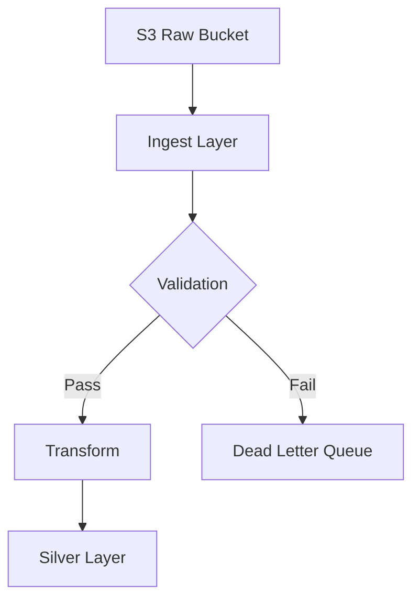
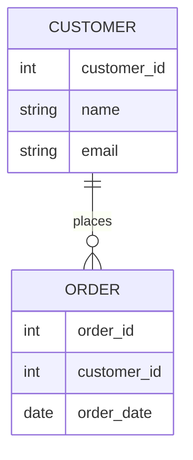

# Bronze to Silver Pipeline

## Overview
This pipeline ingests raw CSV files from an S3 bucket, 
validates and cleans the data, and loads it into the 
Silver layer of a medallion architecture.

## Pipeline Architecture
```text
flowchart TD
    A[S3 Raw Bucket] --> B[Ingest Layer]
    B --> C{Validation}
    C -->|Pass| D[Transform]
    C -->|Fail| E[Dead Letter Queue]
    D --> F[Silver Layer]
```



## Data Model
```text
erDiagram
    CUSTOMER {
        int customer_id
        string name
        string email
    }
    ORDER {
        int order_id
        int customer_id
        date order_date
    }
    CUSTOMER ||--o{ ORDER : places
```



## Notes
- Raw files land in S3 every 15 minutes
- Failed records are logged to the dead letter queue for review
